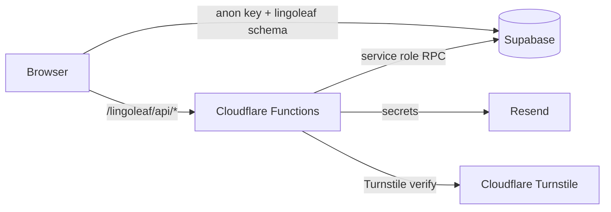

# LingoLeaf Web

**Read in any language. Learn as you go.**

Companion website for LingoLeaf, an iOS language-learning app built around immersive reading. Served at **`/lingoleaf`** on your domain. Uses the **`lingoleaf` Postgres schema** in a shared Supabase project — **not** the mobile app source code.

| | |
|---|---|
| **App routes** | `https://yourdomain.com/lingoleaf/` |
| **App Store** | [Download on iOS](https://apps.apple.com/us/app/lingoleaf/id6758588394) |
| **License** | [MIT](LICENSE) |

<p align="center">
  
</p>

---

## About LingoLeaf

LingoLeaf helps you learn a language by reading books you actually enjoy:

- **1,500+ full-length books** across genres and languages
- **In-context translation** — tap a phrase without losing your place
- **Highlights and vocabulary saving** with context preserved
- **Spaced repetition** to turn reading into retention

The iOS app is a separate codebase. This repo powers the public website and community features around it.

---

## What this site includes

| Feature | Route | Description |
|---------|-------|-------------|
| Landing page | `/lingoleaf/` | App overview and App Store download |
| Feature Forum | `/lingoleaf/features` | Community feature requests, voting, and comments |
| App Updates | `/lingoleaf/updates` | Release notes and discussion |
| Contact | `/lingoleaf/contact` | Email contact form |
| Admin analytics | `/lingoleaf/admin/analytics` | Mobile app event dashboard (forum admins only) |
| API | `/lingoleaf/api/*` | Cloudflare Pages Functions (contact, Turnstile, analytics) |

---

## Tech stack

| Layer | Technology |
|-------|------------|
| Frontend | Vite, React 18, TypeScript, Tailwind CSS, shadcn/ui |
| Auth & database | Supabase (`lingoleaf` schema, shared project) |
| Hosting | Cloudflare Pages |
| Serverless API | Cloudflare Pages Functions |
| Email | Resend |
| Abuse protection | Cloudflare Turnstile + WAF rate limits |



---

## For developers

### Prerequisites

- Node.js 18+
- A Supabase project (for forum/blog features)
- A Cloudflare account (for deployment and Turnstile)

### Local setup

```sh
git clone https://github.com/cjpepin/lingoleaf-web.git
cd lingoleaf-web
npm install
cp .env.example .env
# Fill in VITE_SUPABASE_URL, VITE_SUPABASE_ANON_KEY, VITE_SUPABASE_DB_SCHEMA, VITE_TURNSTILE_SITE_KEY
npm run dev
```

Dev server: [http://localhost:8080/lingoleaf/](http://localhost:8080/lingoleaf/)

### Environment variables

| Variable | Client / server | Purpose |
|----------|-----------------|---------|
| `VITE_SUPABASE_URL` | Client | Supabase project URL |
| `VITE_SUPABASE_ANON_KEY` | Client | Public anon key (RLS-protected) |
| `VITE_SUPABASE_DB_SCHEMA` | Client | Postgres schema (`lingoleaf`) |
| `VITE_TURNSTILE_SITE_KEY` | Client | Turnstile widget site key |
| `SUPABASE_URL` | Server (Cloudflare) | Functions → Supabase |
| `SUPABASE_ANON_KEY` | Server (Cloudflare) | Session validation |
| `SUPABASE_SERVICE_ROLE_KEY` | Server (Cloudflare) | Turnstile verification write only — **never** in `VITE_*` |
| `TURNSTILE_SECRET_KEY` | Server (Cloudflare) | Turnstile server verification |
| `RESEND_API_KEY` | Server (Cloudflare) | Contact form email |

See [`.env.example`](.env.example) for the full list.

### Project structure

```
src/                  React SPA (pages, components, hooks)
functions/lingoleaf/api/  Cloudflare Pages Functions (/lingoleaf/api/*)
supabase/migrations/  Postgres schema, RLS policies, RPCs
tests/                Unit and integration tests
docs/                 Deployment and security setup guides
public/               Static assets and legal pages
```

### Commands

```sh
npm run dev      # Start dev server (port 8080)
npm test         # Run test suite
npm run lint     # ESLint
npm run build    # Production build → dist/
```

### Supabase migrations

Apply the greenfield migration [`supabase/migrations/202604090001_lingoleaf_schema.sql`](supabase/migrations/202604090001_lingoleaf_schema.sql). See [supabase/README.md](supabase/README.md) and [docs/turnstile-supabase-setup.md](docs/turnstile-supabase-setup.md).

### Deployment

Build output goes to `dist/` (assets under `/lingoleaf/`). Cloudflare Pages serves the SPA at `/lingoleaf` and Functions at `/lingoleaf/api/*`. Ensure `public/_redirects` is deployed for SPA fallback.

- [docs/turnstile-supabase-setup.md](docs/turnstile-supabase-setup.md)
- [docs/cloudflare-waf-rate-limits.md](docs/cloudflare-waf-rate-limits.md)
- [docs/DEPLOY.md](docs/DEPLOY.md)

### Security

Report vulnerabilities per [SECURITY.md](SECURITY.md). Before deploying your own instance, review [docs/SECRET_AUDIT.md](docs/SECRET_AUDIT.md).

---

## Contributing

Issues and focused PRs are welcome. See [CONTRIBUTING.md](CONTRIBUTING.md).

---

## Legal

- [Privacy Policy](/lingoleaf/privacy-policy) (on your domain)
- [Terms & Conditions](/lingoleaf/terms-and-conditions)
