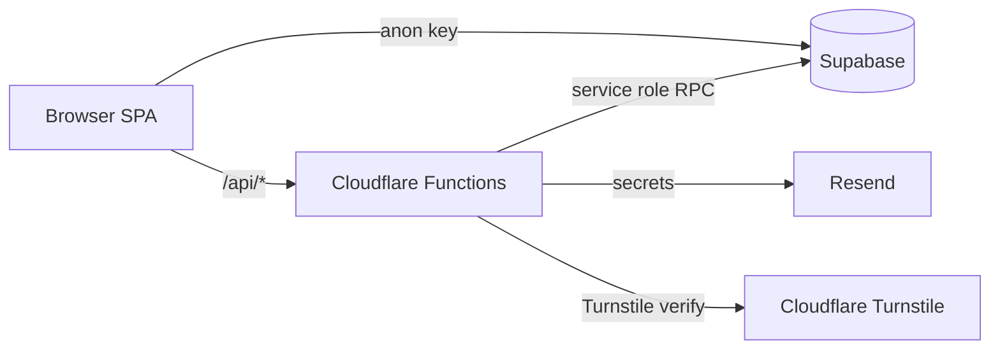

# LingoLeaf Web

**Read in any language. Learn as you go.**

Companion website for [LingoLeaf](https://lingoleaf.app), an iOS language-learning app built around immersive reading. This repository is the marketing site, community forum, app updates blog, and admin tooling — **not** the mobile app source code.

| | |
|---|---|
| **Live site** | [lingoleaf.app](https://lingoleaf.app) |
| **App Store** | [Download on iOS](https://apps.apple.com/us/app/lingoleaf/id6758588394) |
| **License** | [MIT](LICENSE) |

<p align="center">
  
</p>

---

## About LingoLeaf

LingoLeaf helps you learn a language by reading books you actually enjoy:

- **1,500+ full-length books** across genres and languages
- **In-context translation** — tap a phrase without losing your place
- **Highlights and vocabulary saving** with context preserved
- **Spaced repetition** to turn reading into retention

The iOS app is a separate codebase. This repo powers the public website and community features around it.

---

## What this site includes

| Feature | URL | Description |
|---------|-----|-------------|
| Landing page | [/](https://lingoleaf.app/) | App overview and App Store download |
| Feature Forum | [/features](https://lingoleaf.app/features) | Community feature requests, voting, and comments |
| App Updates | [/updates](https://lingoleaf.app/updates) | Release notes and discussion |
| Contact | [/contact](https://lingoleaf.app/contact) | Email contact form |
| Admin analytics | `/admin/analytics` | Mobile app event dashboard (forum admins only) |

Visit the [live site](https://lingoleaf.app) to see the full UI. Screenshots and marketing assets live in [`public/showcase/`](public/showcase/).

---

## Tech stack

| Layer | Technology |
|-------|------------|
| Frontend | Vite, React 18, TypeScript, Tailwind CSS, shadcn/ui |
| Auth & database | Supabase (Postgres, RLS, RPC) |
| Hosting | Cloudflare Pages |
| Serverless API | Cloudflare Pages Functions |
| Email | Resend |
| Abuse protection | Cloudflare Turnstile + WAF rate limits |



---

## For developers

### Prerequisites

- Node.js 18+
- A Supabase project (for forum/blog features)
- A Cloudflare account (for deployment and Turnstile)

### Local setup

```sh
git clone https://github.com/cjpepin/lingoleaf-web.git
cd lingoleaf-web
npm install
cp .env.example .env
# Fill in VITE_SUPABASE_URL, VITE_SUPABASE_ANON_KEY, VITE_TURNSTILE_SITE_KEY
npm run dev
```

Dev server runs at [http://localhost:8080](http://localhost:8080).

### Environment variables

| Variable | Client / server | Purpose |
|----------|-----------------|---------|
| `VITE_SUPABASE_URL` | Client | Supabase project URL |
| `VITE_SUPABASE_ANON_KEY` | Client | Public anon key (RLS-protected) |
| `VITE_TURNSTILE_SITE_KEY` | Client | Turnstile widget site key |
| `SUPABASE_URL` | Server (Cloudflare) | Functions → Supabase |
| `SUPABASE_ANON_KEY` | Server (Cloudflare) | Session validation |
| `SUPABASE_SERVICE_ROLE_KEY` | Server (Cloudflare) | Turnstile verification write only — **never** in `VITE_*` |
| `TURNSTILE_SECRET_KEY` | Server (Cloudflare) | Turnstile server verification |
| `RESEND_API_KEY` | Server (Cloudflare) | Contact form email |

See [`.env.example`](.env.example) for the full list.

### Project structure

```
src/                  React SPA (pages, components, hooks)
functions/api/        Cloudflare Pages Functions
supabase/migrations/  Postgres schema, RLS policies, RPCs
tests/                Unit and integration tests
docs/                 Deployment and security setup guides
public/               Static assets and legal pages
```

### Commands

```sh
npm run dev      # Start dev server (port 8080)
npm test         # Run test suite
npm run lint     # ESLint
npm run build    # Production build → dist/
```

### Supabase migrations

Apply migrations in chronological order under [`supabase/migrations/`](supabase/migrations/). See [docs/turnstile-supabase-setup.md](docs/turnstile-supabase-setup.md) for the full setup guide including admin seeding.

### Deployment

Build output goes to `dist/`. Cloudflare Pages serves the SPA and `functions/` as Pages Functions. See:

- [docs/turnstile-supabase-setup.md](docs/turnstile-supabase-setup.md)
- [docs/cloudflare-waf-rate-limits.md](docs/cloudflare-waf-rate-limits.md)
- [docs/DEPLOY.md](docs/DEPLOY.md)

### Security

Report vulnerabilities per [SECURITY.md](SECURITY.md). Before deploying your own instance, review [docs/SECRET_AUDIT.md](docs/SECRET_AUDIT.md).

---

## Contributing

Issues and focused PRs are welcome. See [CONTRIBUTING.md](CONTRIBUTING.md).

---

## Legal

- [Privacy Policy](https://lingoleaf.app/privacy)
- [Terms & Conditions](https://lingoleaf.app/terms)
